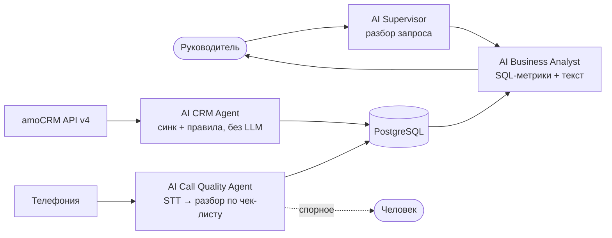

# Тестовое задание CityCar: AI-анализ отдела продаж

Ответ на тестовое задание по вакансии **AI Automation Engineer / AI Agent Developer**.
Автор - Александр Вострухин, AI-инженер. Telegram [@lacomingsoon](https://t.me/lacomingsoon) · lacoming@yandex.ru

**Если у вас 5 минут:** прочитайте краткие ответы ниже. Подробности по каждому пункту - по ссылкам.
**Принцип решения в одной фразе:** цифры считает код, LLM отвечает за смысл, а каждый вывод в отчёте ведёт на сделку в amoCRM или на цитату из звонка.

| # | Вопрос | Кратко | Подробно |
|---|---|---|---|
| 1 | Архитектура | Два контура: фоновый сбор и обработка, контур запроса. Четыре агента в ваших терминах. PostgreSQL + Object Storage в РФ | [01-architecture.md](docs/01-architecture.md) |
| 2 | Сама / человек, риски | Решения о людях, правки CRM и контакт с клиентом - за человеком. Риски: качество данных, несправедливые выводы, 152-ФЗ | [02-automation-and-risks.md](docs/02-automation-and-risks.md) |
| 3 | Код amoCRM | 50 строк, ретраи, пагинация, 7 тестов на имитации API | [ниже](#3-код-сделки-без-задач-или-с-просроченными-задачами) |
| 4 | Реальный AI-проект | Конвейер квалификации клиентов: 834 компании, 842 аудита, вердикт без ИИ, письмо от LLM с проверкой кодом | [04-ai-project.md](docs/04-ai-project.md) |
| 5 | Чему научился | Делить работу между кодом и моделью, мультиагентные системы, недоверенный ввод для LLM, API Директа | [05-learning.md](docs/05-learning.md) |
| 6 | Улучшение | Единая картина 12 проектов: паспорта → пульт и утренний бриф, без ручной сверки | [06-improvement.md](docs/06-improvement.md) |

---

## 1. Архитектура

Руководитель пишет: «Проанализируй работу отдела продаж за последние 30 дней».



- **Фоновый контур** заранее забирает данные. CRM Agent синхронизирует сделки, задачи и события amoCRM (`/api/v4/leads`, `/tasks`, `/events`) инкрементально по `updated_at` и по вебхукам. Call Quality Agent берёт записи из примечаний `call_in` / `call_out`, распознаёт их через SpeechKit или Whisper (стерео разделяет менеджера и клиента) и оценивает по чек-листу. У каждой оценки есть цитата и таймкод.
- **Контур запроса** работает только с базой. Supervisor превращает текст в параметры: период, отдел, метрики, база сравнения. Если запрос неясен, он переспрашивает. Business Analyst считает метрики в SQL против прошлого периода, а LLM пишет текст вокруг готовых чисел. Код сверяет, что числа в тексте совпадают с посчитанными.
- **Хранение:** PostgreSQL для данных, оценок и истории запусков, закрытый бакет для аудио. Всё в РФ.
- **Качество разбора:** эталон из 50-100 звонков, размеченных РОПом. Версии промпта и модели пишутся к каждой оценке.
- **Стоимость:** около 15-25 тыс. ₽ в месяц на 8 800 звонков. Это покрытие 100% звонков против 10% при ручном прослушивании, где на 10% уходит 88 часов РОПа.

[Полная схема, выбор стека, план внедрения и расчёт эффекта →](docs/01-architecture.md)

## 2. Что система делает сама, а что передаёт человеку

**Сама:** собирает данные, расшифровывает и оценивает звонки, считает метрики, находит проблемные сделки, пишет черновик отчёта в формате «что происходит → почему → где проблема → что требует внимания».

**Человеку:**
- решения о сотрудниках;
- любые правки данных в CRM;
- контакт с клиентами;
- звонки с ненадёжной оценкой;
- утверждение чек-листа;
- регулярная калибровка на ручной выборке.

**Три главных риска:**
1. **Качество данных в CRM.** Формально закрытые задачи, непривязанные звонки. Поэтому в каждом отчёте есть блок «покрытие данных».
2. **Ошибочные и несправедливые выводы о людях.** Ошибки распознавания и LLM, разная база лидов у менеджеров. Поэтому цифры только из SQL, у оценок есть цитаты, сравнение идёт внутри однородных групп, а решает человек.
3. **Персональные данные (152-ФЗ).** Записи звонков - это персональные данные клиентов и сотрудников. Поэтому контур российский, доступ по ролям, расшифровка считается недоверенным вводом.

[Подробно, плюс безопасность контура →](docs/02-automation-and-risks.md)

## 3. Код: сделки без задач или с просроченными задачами

[`amo_problem_deals.py`](amo_problem_deals.py) - ровно 50 строк.

- **Два постраничных обхода вместо запроса на каждую сделку.** Сначала все открытые задачи по сделкам: из них сохраняются только сроки, поэтому памяти уходит мало. Потом сделки сверяются с этими сроками.
- **Закрытые сделки пропускаются.** Это системные статусы 142 и 143, одинаковые во всех воронках.
- **Что считается «без задач».** У сделки нет ни одной открытой задачи, то есть нет следующего шага.
- **Устойчивость к сбоям.** Повтор с паузой на 429 и 5xx с учётом `Retry-After`. 401 не повторяется, потому что нужен новый токен. Таймаут стоит на каждом запросе.
- **Тестируемость.** Сессия, адрес и «сейчас» передаются параметрами, поэтому модуль импортируется без переменных окружения и тестируется без сети.

```bash
pip install -r requirements.txt
export AMO_SUBDOMAIN=yourcompany AMO_TOKEN=долгосрочный_токен
python amo_problem_deals.py          # id, название, причина, ссылка на сделку
python -m pytest -q                  # 7 тестов на имитации amoCRM API
```

Что сознательно оставлено за пределами 50 строк (в боевом сервисе это есть):
- обновление OAuth-токена: refresh под блокировкой;
- учёт задач, поставленных на контакт или компанию сделки;
- фильтр по воронке или ответственному;
- выгрузка не в консоль, а в базу.

## 4-6. Опыт

- [**4. Реальный AI-проект.**](docs/04-ai-project.md) Конвейер «разведчик → аудитор → автор письма». Описан по восьми вопросам из вашей вакансии: задача, архитектура, стек, API, как AI получал данные, что делал сам, ограничения, результат. Результат с честными цифрами.
- [**5. Чему научился за полгода.**](docs/05-learning.md) Четыре навыка в формате «навык → где применил → что получилось».
- [**6. Улучшение, доведённое до результата.**](docs/06-improvement.md) Паспорта проектов, пульт и утренний бриф вместо ручной сверки.

---

Готов разобрать решение на созвоне и показать AI-проект вживую.
