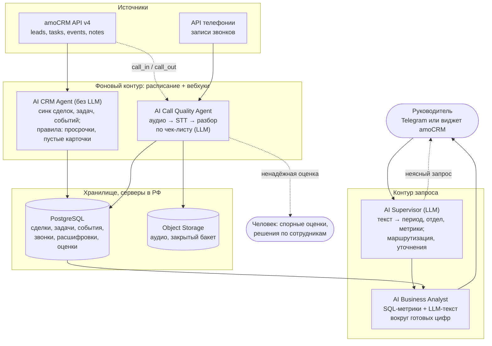

# 1. Архитектура

[← к README](../README.md) · [2. Границы и риски →](02-automation-and-risks.md)

## Идея в трёх строках

- **Два контура.** Фоновый заранее забирает данные из amoCRM и телефонии и обрабатывает звонки. Контур запроса работает только с базой, поэтому ответ на «проанализируй за 30 дней» приходит за минуты, а не за часы.
- **Цифры считает код, смысл - модель.** LLM нужна в трёх местах: разобрать свободный запрос, оценить звонок, написать текст отчёта. Сбор данных и метрики - детерминированный код: дешевле, быстрее и проверяемо.
- **Каждый вывод проверяем.** Утверждение в отчёте ведёт на сделку в amoCRM или на цитату из звонка с таймкодом.

## Схема

Названия агентов взяты из вашей вакансии. Агентами в строгом смысле работают Supervisor и Call Quality: им нужна модель. CRM Agent - обычный сервис синхронизации и правил. Модель ему не нужна, а без неё он дешевле и не ошибается в цифрах.

## Агенты: откуда берут данные и что делают

| Агент | Источник и API | Что делает | LLM |
|---|---|---|---|
| **AI CRM Agent** | amoCRM API v4, OAuth 2.0: `/api/v4/leads`, `/tasks`, `/events` (смена этапа `lead_status_changed`), `/users`, `/leads/pipelines` | Инкрементальный синк по `updated_at` плюс вебхуки. Upsert по id amoCRM, поэтому повторный прогон не плодит дубли. Ночная сверка подбирает потерянные вебхуки. Ретраи на 429 и 5xx, лимит 7 запросов в секунду на интеграцию: при систематическом превышении amoCRM блокирует весь аккаунт. Правила: сделки без задач и с просрочками ([код](../amo_problem_deals.py)), пустые поля карточки, потерянные лиды | нет |
| **AI Call Quality Agent** | Примечания сделок `call_in` / `call_out` в amoCRM (ссылка на запись, длительность, номер), так звонок сразу привязан к сделке. Если телефония не интегрирована - её API и сопоставление по номеру и времени | Запись скачивается в хранилище сразу при синке: ссылки телефонии протухают. Дальше распознавание и разбор по чек-листу | да |
| **AI Business Analyst** | Только PostgreSQL | SQL: конверсия по этапам и менеджерам, время в этапах, скорость первой реакции на заявку, просрочки, звонки и недозвоны, средние оценки. Каждая метрика стоит рядом с прошлыми 30 днями и средним по отделу. Менеджеры сравниваются внутри одной воронки и типа лидов | только текст |
| **AI Supervisor** | Запрос руководителя | Превращает текст в параметры по строгой JSON-схеме: период, база сравнения, отдел (сопоставляется с группами amoCRM), метрики из фиксированного списка. Не хватает данных - задаёт уточняющий вопрос, а не угадывает. Маршрутизирует задачи и передаёт человеку то, что требует решения | да |

## Как обрабатывается звонок

1. **Аудио.** Запись скачивается в закрытый бакет. Звонки короче 20-30 секунд не расшифровываются, но учитываются в метриках дозвона.
2. **Распознавание.** Yandex SpeechKit в отложенном режиме или локальный Whisper. При стереозаписи менеджер и клиент разделены по каналам: диаризация по голосу не нужна, и в биометрию мы не уходим.
3. **Разбор.** LLM оценивает звонок по чек-листу, который утвердил РОП: выявлена потребность, отработаны возражения, назначен следующий шаг, причина отказа. Ответ строго по JSON-схеме, у каждой оценки есть цитата и таймкод. Код проверяет, что цитата действительно есть в расшифровке: это ловит галлюцинации.
4. **Надёжность.** Звонок уходит человеку, если плохо распознан, если у оценки нет цитаты или если два независимых прогона разошлись. Самооценке модели «я уверена» не доверяем.
5. **Качество разбора (evals).** Эталон: 50-100 звонков, размеченных РОПом по тому же чек-листу. Метрика - совпадение с человеком по каждому пункту. В базе к каждой оценке записаны версии чек-листа, промпта и модели. Любая смена сначала прогоняется на эталоне и только потом выкатывается.

## Где хранятся результаты

- **PostgreSQL:** снимки сделок и задач, события, звонки, расшифровки, оценки с версиями, запуски отчётов. Плюс журнал запусков: сколько данных забрано, сколько звонков обработано и с ошибками, время и стоимость на звонок и на отчёт.
- **Object Storage** (Yandex Object Storage или MinIO): аудио в закрытом бакете. Ссылка временная и выдаётся после проверки роли.
- **Всё на серверах в РФ.** Сроки хранения: аудио короче, расшифровки дольше, агрегаты без персональных данных бессрочно. Конкретные сроки утверждает заказчик.

## Отчёт: почему в нём нет выдуманных цифр

Числа подставляются в отчёт шаблоном из результатов SQL, модель пишет только текст вокруг них. Перед выдачей код сверяет, что каждое число в тексте совпадает с посчитанным. Если не совпадает, отчёт пересобирается. Каждое утверждение даёт ссылку на сделку в amoCRM или на цитату звонка.

Структура отчёта повторяет вашу формулировку: **что происходит → почему → где проблема → что требует внимания.** Сначала три главных вывода, потом метрики против прошлого периода, потом конкретные сделки и звонки.

## Почему такой стек

| Выбор | Почему | Альтернатива |
|---|---|---|
| Python-сервисы + PostgreSQL | Одна база для сырых данных, метрик и истории. SQL проверяем и тестируем | n8n удобен для уведомлений и простых связок, но не для ядра: в нём сложнее версионирование, тесты и ревью |
| Supervisor на LangGraph или на простом конечном автомате | Граф состояний, контрольные точки и остановка «ждём решения человека» из коробки | Если сценариев мало - обычный код без фреймворка, меньше зависимостей |
| SpeechKit (отложенный режим) или локальный Whisper | Данные остаются в РФ. Звонки обрабатываются ночью, а отложенный режим самый дешёвый | Потоковое распознавание нужно, только если разбор звонка нужен сразу после него |
| YandexGPT или GigaChat; локальная модель для чувствительных данных | 152-ФЗ, без трансграничной передачи | Зарубежные модели - только после юридического решения заказчика |
| RAG по расшифровкам (pgvector) - **не в MVP** | Пригодится для вопросов вроде «где клиенты жаловались на цену» | В MVP хватает SQL и тегов из разбора звонков |

## План внедрения (MVP)

Каждый шаг даёт пользу сам по себе:

1. **Синк amoCRM и метрики.** Воронка, сроки, сделки без задач и с просрочками. Первый отчёт без LLM, сразу полезен РОПу.
2. **Звонки.** Привязка к сделкам, расшифровка, разбор по утверждённому чек-листу. Сначала эталон и сверка с человеком, только потом оценки попадают в отчёт.
3. **Запрос свободным текстом.** Supervisor, отчёт со сравнением с прошлым периодом, интерфейс в Telegram или виджете amoCRM.
4. **По результатам:** напоминания в CRM, AI Sales Agent на входящих, поиск по расшифровкам.

## Экономика: затраты → экономия → эффект

Расчёт на допущениях, цифры уточняются на пилоте.

**Допущения:** 10 менеджеров, 40 звонков в день на каждого, средний звонок 3 минуты, 22 рабочих дня.
Это 8 800 звонков и около 26 400 минут аудио в месяц.

| Статья | Как считал | В месяц |
|---|---|---|
| Распознавание, SpeechKit в отложенном режиме | 0,0381 ₽ за 15 секунд двухканального аудио ([тариф](https://aistudio.yandex.ru/docs/ru/speechkit/pricing)) ≈ 0,15 ₽/мин | ~4 тыс. ₽ |
| LLM-разбор | Оценка: 1-2 ₽ на звонок (около 3-4 тыс. токенов), уточняется на пилоте | ~9-18 тыс. ₽ |
| **Итого** | | **~15-25 тыс. ₽** |

**Сравнение с ручной работой.** Чтобы РОП прослушал и оценил хотя бы 10% звонков (880 штук по 6 минут), нужно около 88 часов в месяц. Это больше половины его рабочего времени. Система покрывает 100% звонков, а человек тратит время только на спорные случаи и разбор с менеджерами.

**Финансовый эффект** считается не в часах РОПа, а в возвращённых сделках. Сделки без следующего шага и просрочки видны каждый день, а не в конце месяца. Если система возвращает в работу хотя бы одну-две сделки в месяц, она окупает себя при среднем чеке выше месячных затрат на неё. Точную цифру даст сравнение конверсии до и после на пилоте.
