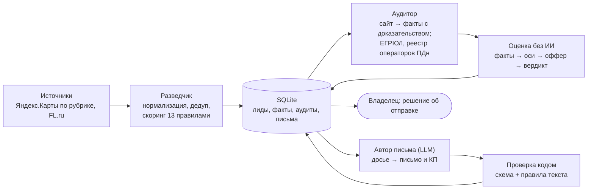

# 4. Реальный AI-проект

[← README](../README.md) · [5. Чему научился →](05-learning.md)

## Система поиска и квалификации клиентов («Комната лидов»)

Конвейер из трёх ролей: разведчик → аудитор → автор письма. Он находит компании малого бизнеса, проверяет их сайты и госреестры и готовит персональное письмо под найденную проблему. Спроектировал и написал один, используется в моей работе. Код закрытый, на собеседовании покажу экран и базу.

Раздел построен по восьми вопросам из вашей вакансии.

### Бизнес-задача

Найти клиентов на мои услуги (сайты, автоматизация, реклама) так, чтобы письмо начиналось с реальной проблемы конкретной компании, а не было массовой рассылкой. Например: сайт не открывается на телефоне, нет политики обработки персональных данных при форме заявки, компания не числится в реестре операторов ПДн. Руками такой разбор одной компании занимает, по моей оценке, 15-20 минут, поэтому на сотни компаний его никто не делает.

### Архитектура

Принцип тот же, что в [архитектуре для CityCar](01-architecture.md): вердикт считает код, модель пишет только текст.

### Стек

Python (около 8 300 строк, без фреймворков), SQLite (WAL, больше 20 таблиц), Claude как модель для текста письма, правила и тексты офферов вынесены в JSON.

### Какие API и источники

- **Яндекс.Карты:** организации по рубрике и округу. Сначала проверил 2ГИС: страницы отдают пустую оболочку, а официальный API платный. Решение записано в коде отдельной заметкой.
- **FL.ru:** RSS заказов.
- **Сайты компаний:** свой HTTP-клиент с таймаутами, ретраями, троттлингом по домену и дисковым кэшем.
- **egrul.nalog.ru:** статус и дата регистрации юрлица, с кэшем.
- **Реестр операторов ПДн Роскомнадзора:** есть ли компания в реестре.

### Как AI получал данные

Модель не ходит в сеть и не читает базу. Код собирает для неё досье: факты аудита с доказательствами (что найдено и на какой странице), выбранные офферы и правила текста. Тексты с чужих сайтов попадают в промпт только внутри разделителей как недоверенные данные. Это защита от инструкций, спрятанных на странице.

### Что выполнялось самостоятельно, без человека

- Обход источников с частичным результатом: падение одного источника не роняет весь прогон.
- Нормализация телефонов (E.164), почт, доменов и ИНН с проверкой контрольной суммы.
- Дедупликация: сильный ключ сливает записи, а слабый только помечает их как возможные дубли.
- Аудит сайта примерно за 22 секунды на домен. У каждого признака три значения: да, нет, неизвестно. «Нет» засчитывается только при полной проверке.
- Сверка с госреестрами, вердикт и выбор не больше двух офферов.
- Подготовка задания для модели, проверка её ответа по схеме и правилам, запись письма в базу со статусом «черновик».

### Ограничения

- Отправку писем делает только человек. Почтовая инфраструктура (SPF, DKIM, DMARC, прогрев) ещё в работе, поэтому письма пока не отправлялись.
- Автор письма сейчас запускается из рабочей сессии, а не по расписанию. Перенос на сервер 24/7 с отдельным бюджетом на модель - следующий этап.
- Юридические признаки дают доверие и повод для письма, но в балл не входят: письмо в духе «у вас нарушение, штраф» - не та интонация.
- Часть сайтов не даёт себя проверить (защита от ботов, только JS). Для них вердикт «неизвестно», а не догадка: таких 168 из 842.

### Результат

| Показатель | Значение |
|---|---|
| Компаний в базе | 834 |
| Проведено аудитов | 842, собрано 14 500 фактов с доказательствами |
| Прошли отбор | 287 (из них у 60 сломан сайт, у 110 сайта нет) |
| Отсеяно как «нечего предложить» | 382 - на них не уйдёт ни одного лишнего письма |
| Подготовлено писем | 64 черновика, все прошли проверку кодом |

Честно о бизнес-результате: денег система пока не принесла, рассылка стартует после настройки почты. Что она уже дала:
- аудит одной компании за 22 секунды вместо 15-20 минут вручную;
- отсев 382 компаний, которым нечего предложить, до того как на них потрачено время;
- пересчёт вердиктов по всей базе за секунды и бесплатно: калибровка порогов не стоит денег на модель.

## Где ещё работает тот же подход

**Рабочая среда на Claude Code**, на которой я веду все клиентские проекты. Типовые шаги вынесены в отдельных агентов: планирование, проверка кода, проверка безопасности, тексты клиенту. Каждая сессия стартует с паспортом проекта (статус, риски, следующий шаг) и с базой из 200+ разборов прошлых ошибок.

Результат: один веду шесть клиентских проектов одновременно - 1С, интернет-магазин, лендинги, реклама. Проверки кода и безопасности не пропускаются под дедлайном.

Подробнее про сборку статуса проектов - в [разделе 6](06-improvement.md).
